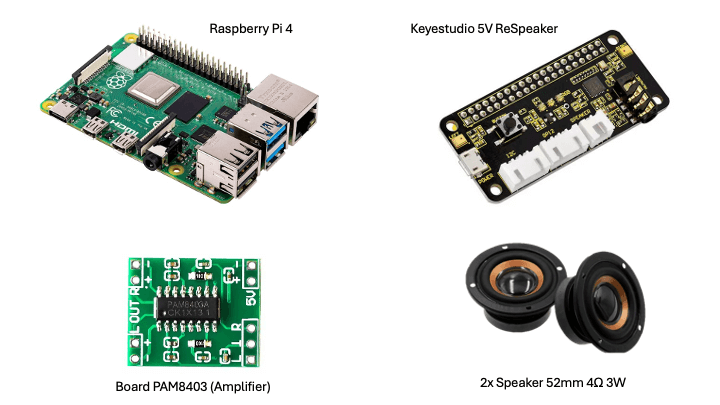

# My.Assistant

**Warning:** This project is a Proof of Concept. I will modify it when I complete it.

## Hardware setup
- Raspberry 4
- Keyestudio 5V ReSpeaker 2 Mic Pi HAT V1.0
- Board PAM8403 (Amplifier)
- 2x Speaker 52mm 4Ω 3W
- Powerbank 20000mah (2x USB, 1 USB-c, 1 mini usb)

## Software setup
- [Seeed Voicecard](https://github.com/HinTak/seeed-voicecard) used as driver for *Keyestudio 5V 2 Mic Pi HAT V1.0* since official version is outdated
- [Vosk](https://github.com/alphacep/vosk-api) tested with python and worked fine, but I want to improve it by compiling the C code to increase performance.
- [Piper](https://github.com/rhasspy/piper) tested with python and worked fine. It struggles to process a big text. Splitting it into small sentences is a good strategy to go.
- [ChatGPT](https://platform.openai.com/docs/guides/text?api-mode=responses) take some time to respond, but answer is very accurate (except for some information about news, weather, etc)

## Improvements to do
- Use memory buffer instead of saving wav file into a file
- Don't block main thread for some audios (Ex: confirmation sound, feedback before chatgpt request, etc)
- Investigate how to mix languages with vosk - problem with to identify terms in english when portuguese is set.
- Fix "input overflow" error
- Implement a web server for debug purpose

## Useful commands
- `aplay -l` # get all output devices
- `amixer -c 3 sset 'Headphone' 60%` # set volume of headset (Keyestudio 5V ReSpeaker output). It will only work if Keyestudio 5V ReSpeaker is card 3
- `amixer -c 3 sset 'Speaker' 60%` # set volume of speaker (Keyestudio 5V ReSpeaker output). It will only work if Keyestudio 5V ReSpeaker is card 3